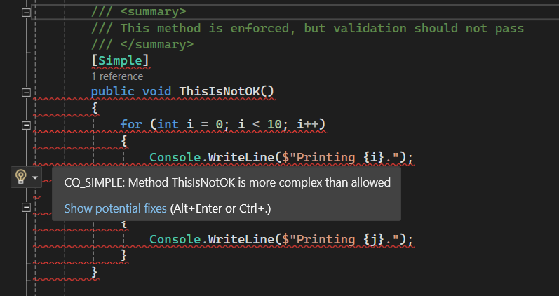

Simple demo for using .NET code generators to enforce project- or team- specific code quality standards.

General usage pattern:

 - Define .NET attributes for your code quality rules
 - Apply those attributes to the classes/methods/interfaces that you want enforced
 - Write custom code generators that scan for those attributes and add warnings/errors whenever the underlying code quality standards are broken

Benefits:
 - These warnings/errors are treated by the IDE or build tool just like regular compilation warnings/errors.
 - The logic behind them is 100% specific to your team/project, can be easily viewed and changed and is fully customizable.
 - No third-party dependencies of any kind are needed (other than those for code generators).

Some of the things that can be enforced this way (in order of complexity):

 - Ensure that some parts of the code (e.g. business logic methods, services) don't exceed a certain complexity, in terms of nesting, total number of statements, expression complexity, etc.
 - Ensure that public-facing APIs/endpoints only return DTO objects marked as such
 - Ensure that certain code structure rules are followed (e.g. certain enums, the interfaces that use them and their implementations all follow specific namespace rules)
 - Ensure that very specific coding rules are followed, e.g. that every method that works with an instance of a certain interface calls a specific method on that interface before returning, on all code paths.
 - Since this is a generator, it can also emit code to enforce rules at runtime, e.g. by wrapping any given service, by injecting initialization code, etc.

Project structure:

| Project | Purpose  |
|--|--|
| Common | Common code between the generator and the actual project code. Contains the attributes and other things needed to describe the rules to be enforced. |
| CodeGeneratorEnforcer | The actual project codebase, to be enforced by the generator. |
| ActualGenerator | The generator project that does the actual enforcing |

Things to pay a bit more attention to:

 - The `.csproj` files. Linking the three projects together PROPERLY is not difficult, but does require a bit of trial and error. Comments in the `.csproj` files have been left to help with this.
 - Debugging is not quite user friendly or intuitive, the best way to do it is via code in the `Initialize()` method.
